# Overview: 

### On January 23, 2026, Maromalix's finance department received an alarming call from TechCorp Industries, a long-standing client. TechCorp's accounts payable team reported they had processed a wire transfer to what they believed was Maromalix's bank account after receiving an invoice for services rendered. However, Maromalix had not issued any such invoice to TechCorp.

**During the week prior to the incident, Maromalix onboarded a new cloud administrator. During this transition period, several IAM permission adjustments were made as users reported access issues with various services. Some of these changes may have resulted in overly permissive policies - activity related to these legitimate administrative actions may appear in the logs.**

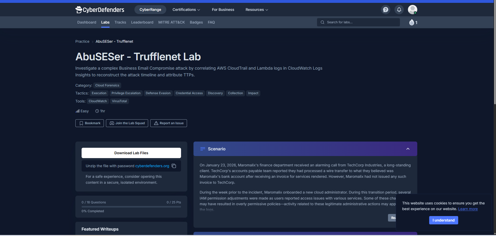

<br>

### Methodology: 

**The primary investigation tool will be AWS CloudWatch Logs Insights - we will use it to query CloudTrail and Lambda execution logs, reconstruct the attack timeline, and identify indicators of compromise.**

---

<br>

### Attack Chain: 

---

<br> 

## Indicators of Compromise:

| IOC Type                  | Value               |
| -------------------------- | -------------------- |

---

<br>

## MITRE ATT&CK Mapping:

| ATT&CK ID | Technique                                                | Evidence                                        |
| --------- | -------------------------------------------------------- | ----------------------------------------------- |

---

<br>

# Investigation:

## 1. Reconaissance

### 1.1) During the initial threat hunting phase, analysis of CloudTrail logs revealed API calls from multiple source IP addresses. One IP address stood out as highly suspicious due to its association with multiple identities and offensive security tooling. What is this attacker's IP address?

For this one, I first went to view the custom logs of the api calls, and saw that "sourceIP" and "accountID" are formatted in JSON, so we can search for number of distinct accountIDs associated with different sourceIPs, since we know this suspicious account was associated with multiple identities:

```sql
SOURCE logGroups(namePrefix: [], class: "STANDARD") START=2026-01-23T00:00:00.000Z END=2026-01-23T23:59:59.000Z |
fields @timestamp, @message
| parse @message '"sourceIPAddress":"*"' as sourceIPAddress
| parse @message '"accountId":"*"' as accountId
| filter ispresent(sourceIPAddress) and ispresent(accountId)
| stats count_distinct(accountId) as distinctAccounts by sourceIPAddress
| sort distinctAccounts desc
```

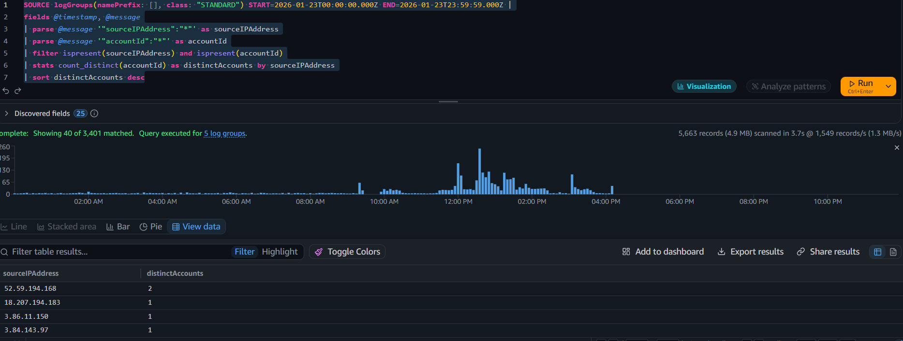

We can see there is only one IP associated with multiple IDs: **52.59.194.168**. Let's confirm by querying that IP specifically to analyze their offensive tooling:

```sql
SOURCE logGroups(namePrefix: [], class: "STANDARD") START=2026-01-23T00:00:00.000Z END=2026-01-23T23:59:59.000Z |
fields @timestamp, @message
| parse @message '"sourceIPAddress":"*"' as sourceIPAddress
| parse @message '"userAgent":"*"' as userAgent
| filter sourceIPAddress == "52.59.194.168"
| display userAgent
```
We can see below that this IP address is associated with both Pacu and TruffleHog - both very well known offensive tools for AWS exploitation and finding leaked credentials.

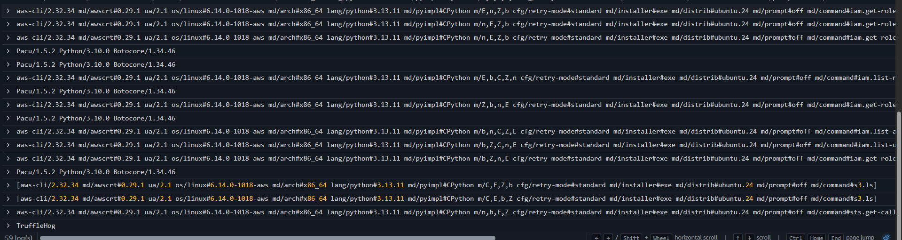

**Answer: 52.59.194.168**

### 1.2) The attacker's first action was to probe for publicly accessible resources. What is the full name of the S3 bucket they discovered?

Sorting by ascending timestamps, we see the truffleHog was the first agent associated with an API call from the attacker IP. I did a quick google search to find that TruffleNet separately finds scans and finds credential info (separate from any API call we see here), then TruffleNet tests the credential (which we know is successful since there is a successful API call with no error fields):

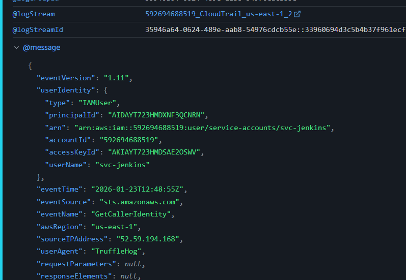

We see it test the credentials in a GetUserIdentity API call, then the next log is svc-jenkins running the same API call with the same credentials:

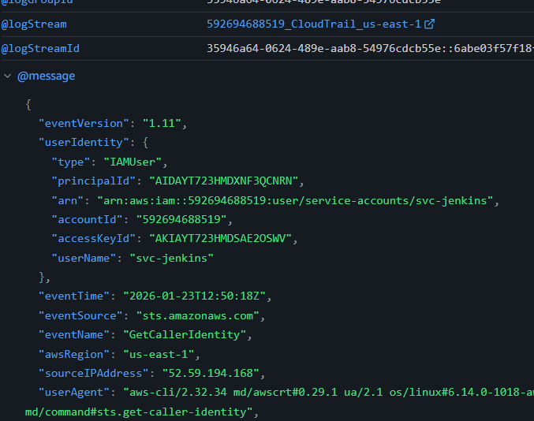

Since the attacker now has access, we will look at the logs following shortly after to see where he accessed an S3 bucket: 

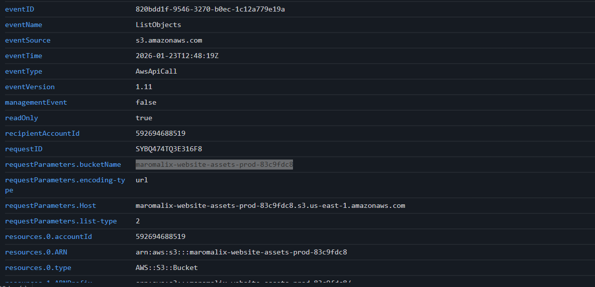

In the very next log, see the API call accessing the S3 bucket with the name of: **"maromalix-website-assets-prod-83c9fdc8"**

**Answer: maromalix-website-assets-prod-83c9fdc8**

---

<br>

## 2. Initial Access

### 2.1) The attacker used a tool designed to scan repositories and file systems for exposed secrets, then automatically validate any discovered credentials. What is the name of this tool?

We already found this above - the attacker uses **TruffleHog** - (TruffleNet to scan for exposed secrets then TruffleHog to validate the credentials).

**Answer: TruffleHog**

### 2.2) The credentials discovered by the attacker belonged to a service account. What is the name of this initially compromised user?

We also found this one above. After the truffleHog validation, the next API call is from an account called **"svc-jenkins,"** indicating this is the compromised user. 

**Answer: svc-jenkins**

---

<br>

## 3. Discovery #1

### 3.1) To systematically enumerate the AWS environment and discover potential privilege escalation paths, the attacker used an open-source cloud exploitation framework. Provide the name and version of this tool as recorded in the logs.

Investigating logs of the other known offensive security tool used (Pacu):

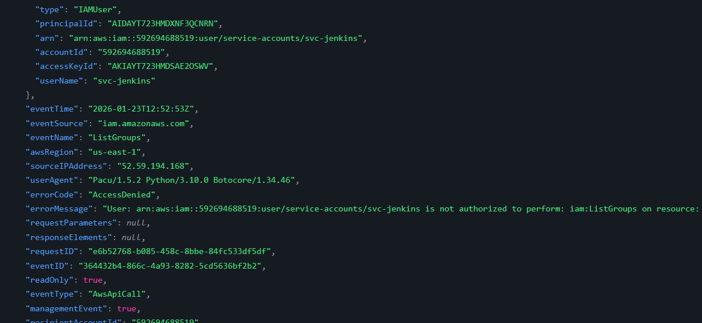

We see attempts at environment enumeration with **Pacu/1.5.2.** The above API call attempts listGroups but access is denied. In following logs, the attacker also tries to call listUsers which is also denied, but is able to successfully make listPolicies and listRoles calls.  

**Answer: Pacu/1.5.2**

---

<br>

## 4. Privilege Escalation

### 4.1) The attacker discovered an overly permissive trust policy and escalated their privileges. What is the name of the first role the attacker successfully assumed?

For this we can simply list the roles that the attacker IP uses in chronological order using "type: AssumedRole" and list the userName of each:

```sql
SOURCE logGroups(namePrefix: [], class: "STANDARD") START=2026-01-23T00:00:00.000Z END=2026-01-23T23:59:59.000Z |
fields @timestamp, @message
| parse @message '"sourceIPAddress":"*"' as sourceIPAddress
| parse @message '"type":"*"' as typeRole
| parse @message '"userName":"*"' as userName
| filter typeRole == "AssumedRole" and sourceIPAddress == "52.59.194.168"
| display eventName, userName
| sort @timestamp asc
```

This returns the results: 

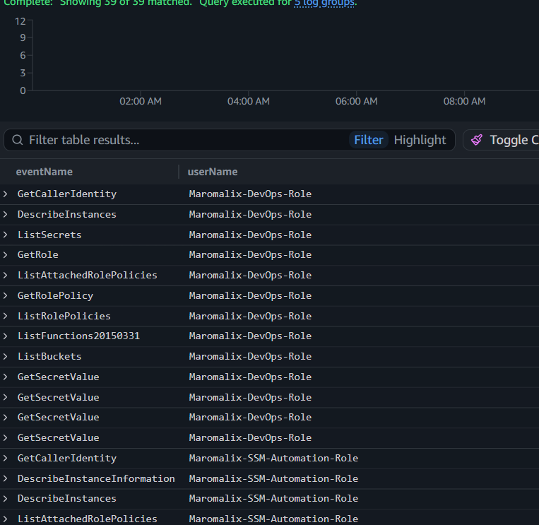

We can see that the first assumed role is **"Maromalix-DevOps-Role,"** and its privilege escalation almost surely came from the successful GetSecretValue call. 


**Answer: Maromalix-DevOps-Role**

### 4.2) When assuming the new role, the attacker specified a custom session name to identify their session. What was this session name?

For assumed roles, the session name comes at the end of the arn:

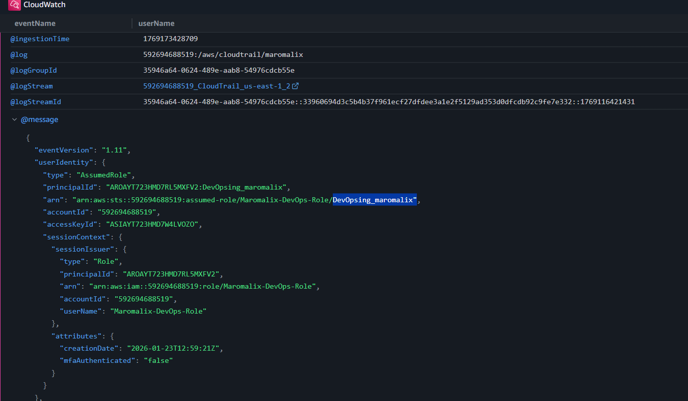

We can see here the custom session name used is **"DevOpsing_maromalix".**

**Answer: DevOpsing_maromalix**

---

<br>

## 5. Discovery #2

### 5.1) With elevated privileges, the attacker enumerated several AWS services looking for sensitive data. Which AWS service did they successfully query to discover stored credentials and secrets?

When opening up one of the GetSecretValue calls:

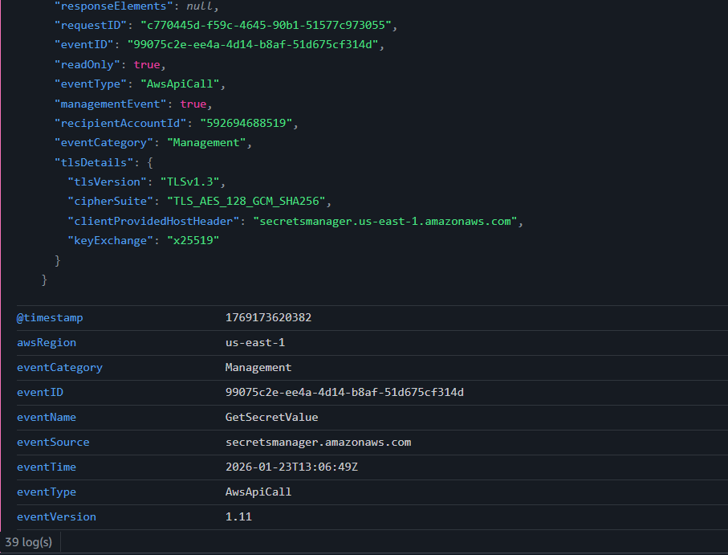

We see the service and source of the successful event is **"secretsmanager"**, which is a service that allows you to rotate, manage, and retrieve database credentials, API keys, and other secrets.

**Answer: Secrets Manager**

---

<br>

## 6. Credential Access #1

### 6.1) After discovering the secrets inventory, the attacker began exfiltrating credentials. What is the ID of the first secret the attacker retrieved?

Viewing the first successful GetSecretValue call:

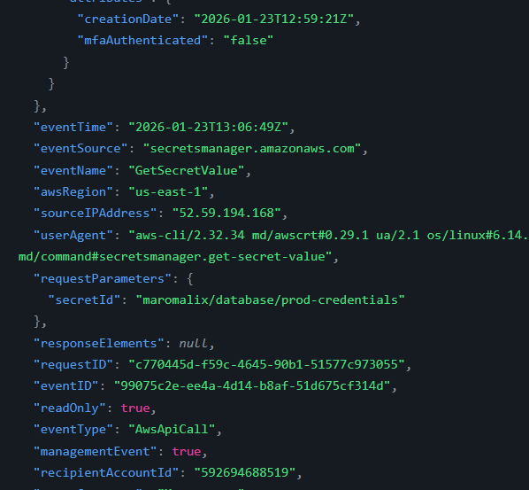

We see that the ID of the first secret the attacker retrieved is "maromalix/database/prod-credentials"

For some reason though, CyberDefenders didn't accept that answer, and instead accepted "maromalix/automation/ssm-credentials", which was the secret ID of the second successful GetSecretValue call. I added the @timestamp to be included in the query, and it turns out that the first three GetSecretValue calls occurred at the exact same time: 


Which explains the confusion. The correct answer could be any of these 3, but CyberDefenders accepts **maromalix/automation/ssm-credentials.**

**Answer: maromalix/automation/ssm-credentials**

### 6.2) What is the MITRE ATT&CK technique ID that corresponds to this credential exfiltration behavior?

Cloud Secrets Management Stores (T1555.006): Adversaries query cloud-native secret vaults like AWS Secrets Manager or Azure Key Vault for bulk credential retrieval.

**Answer: T1555.006**

---

<br>

## 7. Lateral Movement

### 7.1) Using credentials obtained from the exfiltrated secrets, the attacker pivoted to a different IAM role. What is the full name of this role?

We can see in the photo in my answer to 4.1, the attacker pivoted to a role named "Maromalix-SSM-Automation-Role".

**Answer: Maromalix-SSM-Automation-Role**

---

<br>

## 8. Credential Access #2

### 8.1) The attacker used their new role to remotely execute commands on an EC2 instance and steal its IAM credentials via the Instance Metadata Service (IMDS). Provide the API call used to execute commands and the instance ID of the compromised machine, separated by a comma.

Viewing the logs coming from the assumedRole of "Maromalix-SSM-Automation-Role," the only eventName that is indicative of remote execution would be **"SendCommand,"** which also occurs just before the logs of the next assumedRole of "Maromalix-EC2-WebApp-Role" come in so this is very likely the remote execution: 

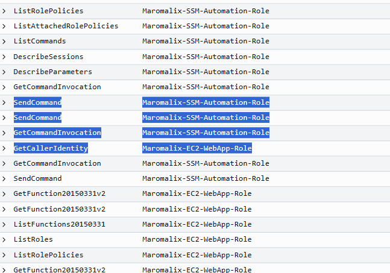

Opening up the SendCommand API call log:

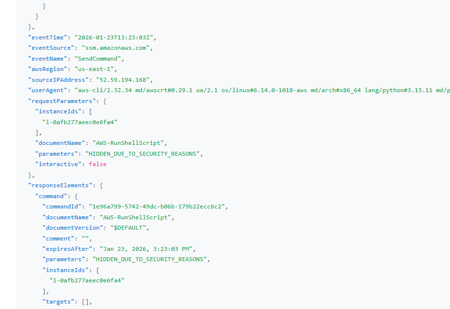

We can indeed see here that a script was run against SSM (Systems Manager - can run commands to EC2 through SSM), and even though the responseElements.command.parameters and requestParameters.parameters are both "HIDDEN_DUE_TO_SECURITY_REASONS", we can infer given the subsequent API calls from the EC2 role that this script was responsible for stealing the IAM credentials.

For the second part of the question (finding instance ID of the compromised machine), we need to go into the log from the new role:

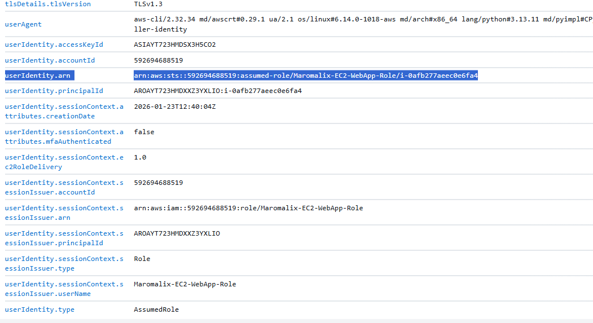

We know from question 4.2 that for assumed roles, the session name comes at the end of the arn which we can see here is **"i-0afb277aeec0e6fa4."**

**Answer: SendCommand, i-0afb277aeec0e6fa4**

---

<br>

## 9. Discovery #3

### 9.1) With EC2 instance credentials, the attacker enumerated Lambda functions by downloading their configurations and code. What is the name of the first Lambda function the attacker retrieved?

We can see above that there are multiple API calls called "GetFunction20150331v2," so we will open the first one:

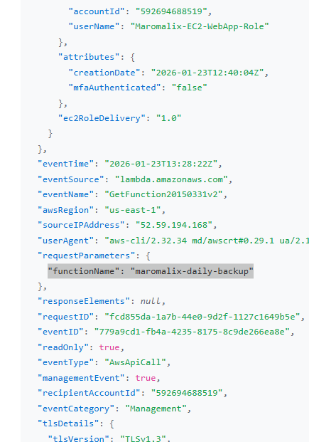

Here we can see the first Lambda function that the attacker retrieved is **"functionName: maromalix-daily-backup"**.

**Answer: maromalix-daily-backup**

### 9.2) After examining multiple functions, the attacker identified one suitable for their attack. What is the name of the Lambda function he used to send fraudulent emails?

After analyzing the other 3 GetFunction20150331v2 calls, one was a second daily-backup call, and the other 2 were **"maromalix-email-notifications,"** and given these two "Invoke" calls: 

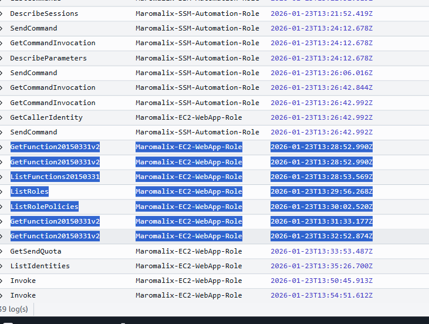

Were both "requestParameters.functionName: arn:aws:lambda:us-east-1:592694688519:function:maromalix-email-notifications", we know it is this lambda function.

**Answer: maromalix-email-notifications**

---

<br>

## 10. Impact

### 10.1) The attacker sent fraudulent emails to two recipients. Provide both email addresses separated by a comma, with the internal recipient first.

**Answer:**

### 10.2) The fraudulent invoice included attacker-controlled contact email addresses. What are the two domains used for these contact addresses? (Provide both domains separated by a comma, in alphabetical order)

**Answer:**

### 10.3) The attacker's ultimate goal was to deceive the victim into transferring funds via a fraudulent invoice. What is the MITRE ATT&CK technique ID that corresponds to this impact?

**Answer:**

### 10.4) Based on the tools, TTPs, and infrastructure patterns observed in this investigation, this incident matches a known threat campaign. What is the name of this campaign?

**Answer:**

---
