# Overview: 

## Your organization utilizes AWS to host critical data and applications. An incident has been reported that involves unauthorized access to data and potential exfiltration. The security team has detected unusual activities and needs to investigate the incident to determine the scope of the attack.

 

### Methodology: 

**The primary investigation tool will be Splunk to parse CloudTrail logs and reconstruct the attacker's kill chain**

---

 

### Attack Chain: 

### Attack Chain:

                           Brute-force attack compromises helpdesk.luke account
                                                    ↓
                             Attacker authenticates with valid AWS credentials
                                                    ↓
                                S3 buckets enumerated and objects accessed
                                                    ↓
                        Sensitive files, including CAD designs, downloaded from S3
                                                    ↓
                         S3 bucket configuration modified to allow public access
                                                    ↓
                                 New IAM user "marketing.mark" created
                                                    ↓
                            marketing.mark added to the privileged "Admins" group
                                                    ↓
                           Persistence established through privileged IAM account
                               
---

  

## Indicators of Compromise:

| IOC Type                  | Value               |
| -------------------------- | -------------------- |

---

 

## MITRE ATT&CK Mapping:

| ATT&CK ID | Technique                                                | Evidence                                        |
| --------- | -------------------------------------------------------- | ----------------------------------------------- |

---

 

## Investigation:

### 1. Knowing which user account was compromised is essential for understanding the attacker's initial entry point into the environment. What is the username of the compromised user?

For this one I want to just make a simple query: 

index="aws_cloudtrail"
| sort by eventTime asc

To see what the log structure and fields look like: 

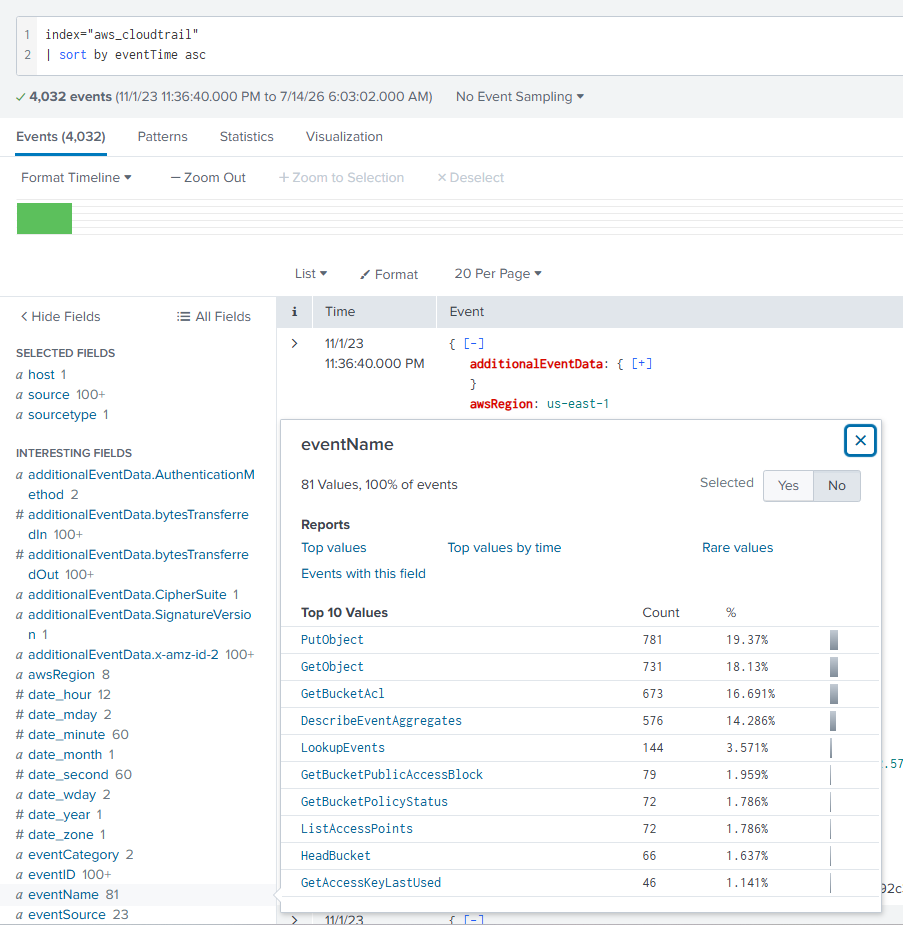

It seems like the eventName field would help us narrow down which account was compromised and the method: 

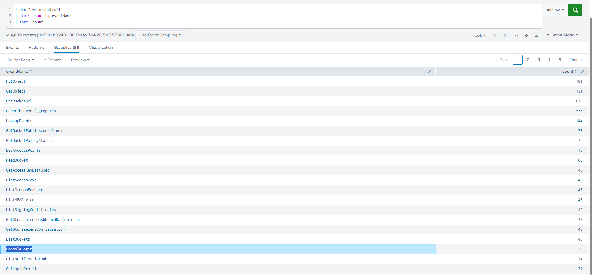

Then I check users associated with logins and helpdesk.luke catches our eye with lots of events. 

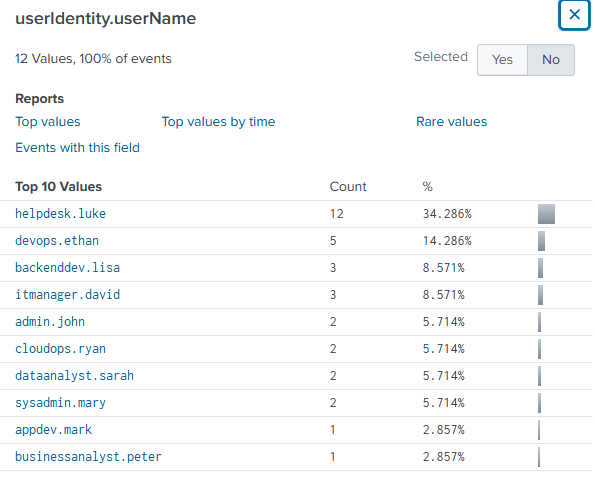

Checking the helpdesk.luke login logs, we see its indicative of brute force (9 failed logins followed by success starting at 9:53:27.000 AM w 2-5 secs between each)

**Answer: helpdesk.luke**

---

### 2. We must investigate the events following the initial compromise to understand the attacker's motives. What is the timestamp for the first access to an S3 object by the attacker?

First we check for eventnames associated with the compromised account - helpdesk.luke:

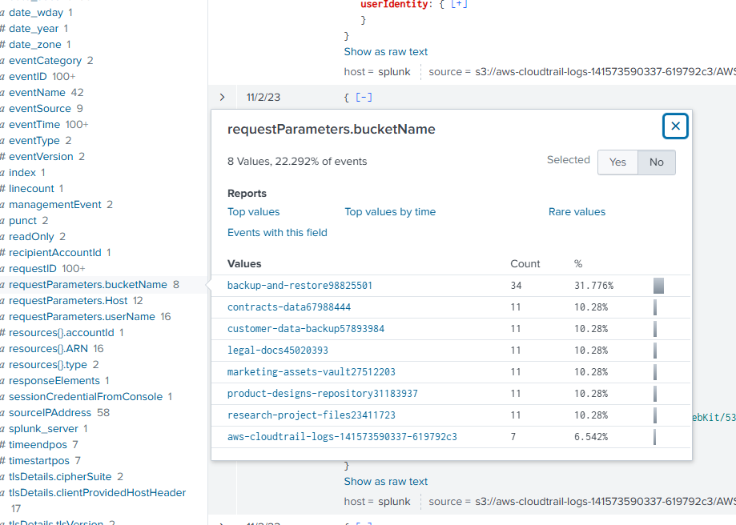

Here we found bucketName field - only getObject could be the accessing of the S3 bucket: 

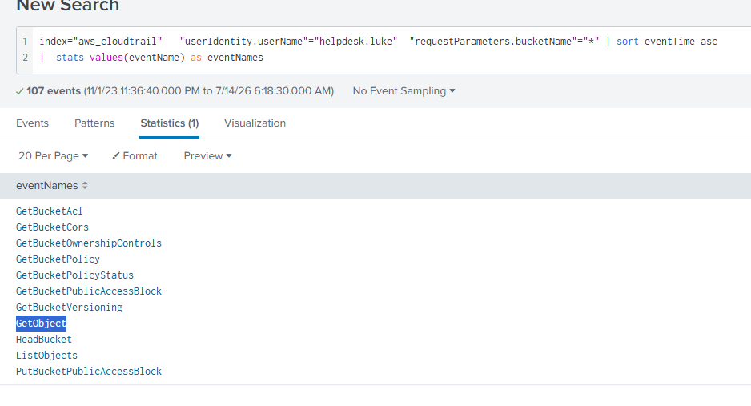

Then I sorted in chronological order and opened first getObject log: 

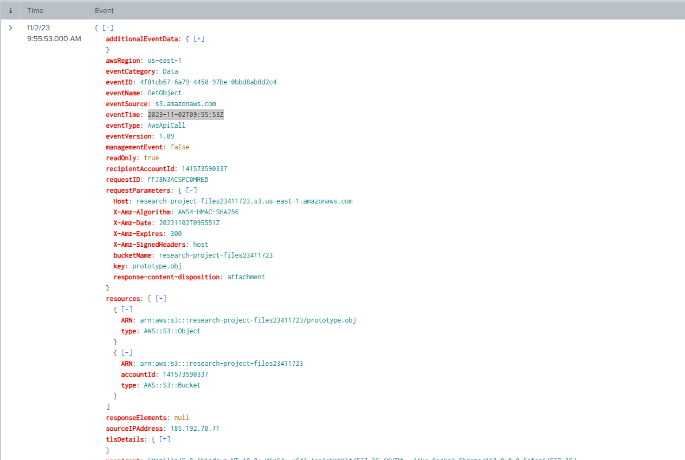

Here we see the timestamp of the first s3 bucket access is 2023-11-02T09:55:53Z

**Answer: 2023-11-02 09:55**. (writeup for this question not done yet)

---

### 3. Among the S3 buckets accessed by the attacker, one contains a DWG file. What is the name of this bucket?

Searching the same query but adding a "DWG" filter to it, we get:

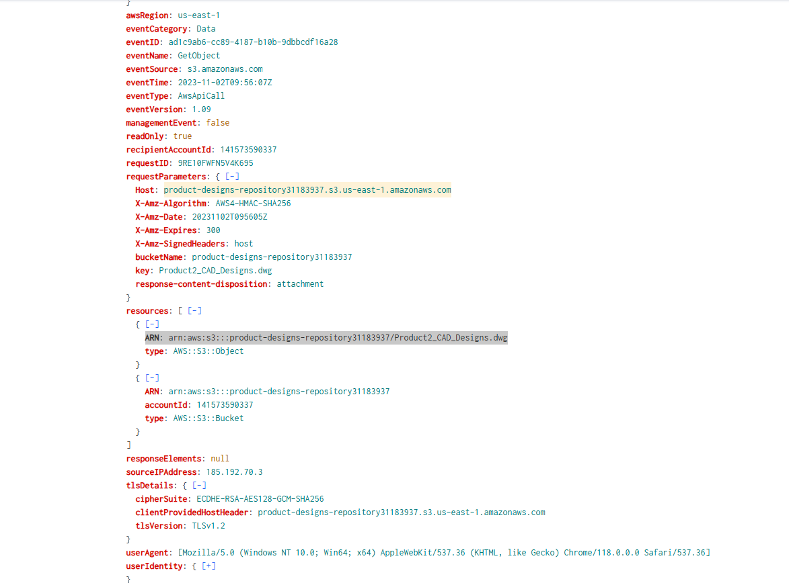

Here we can see that the file "Product2_CAD_Designs.dwg" was from the bucket "product-designs-repository31183937"
**Answer: product-designs-repository31183937**

---

### 4. We've identified changes to a bucket's configuration that allowed public access, a significant security concern. What is the name of this particular S3 bucket?
We can see in #2 a call called PutBucketPublicAccessBlock, so let's analyze it.

Searching for that we only find one result which makes things really easy: 

**Answer: backup-and-restore98825501**

---

### 5. Creating a new user account is a common tactic attackers use to establish persistence in a compromised environment. What is the username of the account created by the attacker?

For this we search for eventName="*user*" assuming the event for creating a user will have that in it and we see the eventName which is simply named CreateUser which only has 1 event:

Clicking into the 1 event we have our username: 

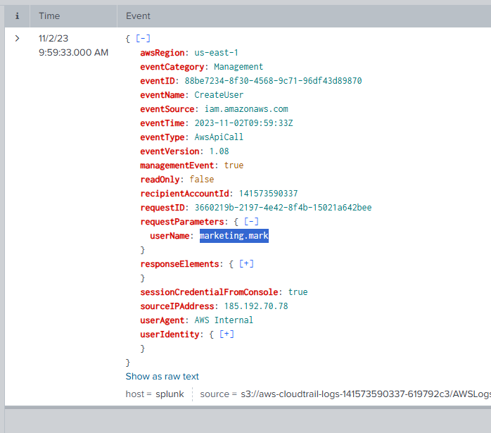

**Answer: marketing.mark**

---

### 6. Following account creation, the attacker added the account to a specific group. What is the name of the group to which the account was added?

Querying for only results with userName marketing.mark, we see the event of AddUserToGroup with 1 event:

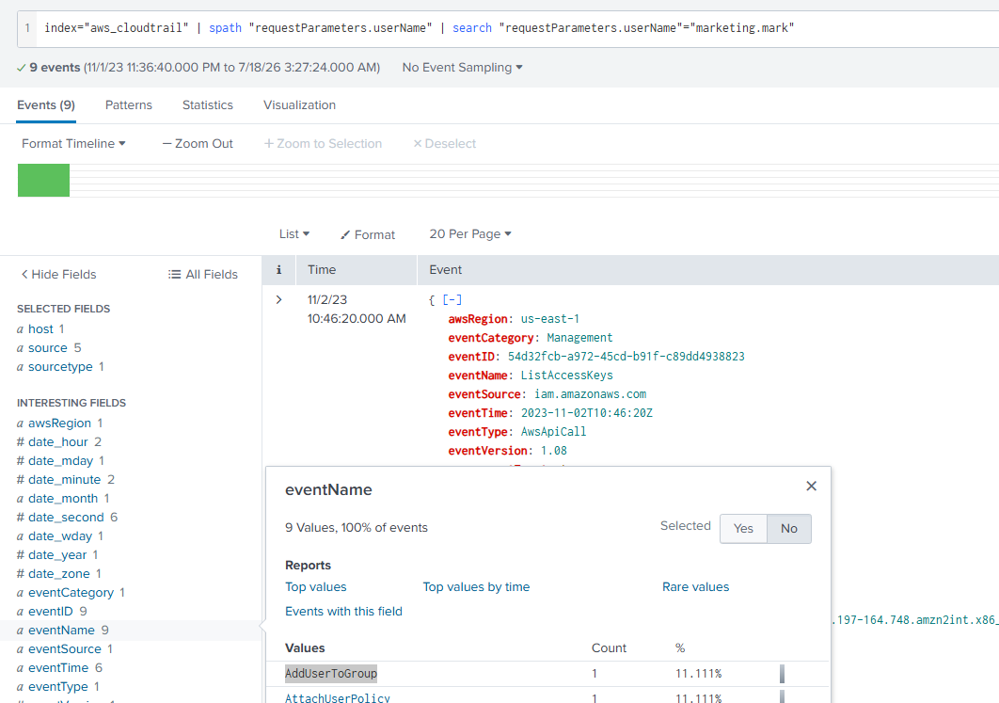

Clicking into the 1 event, we see the group it was added to:

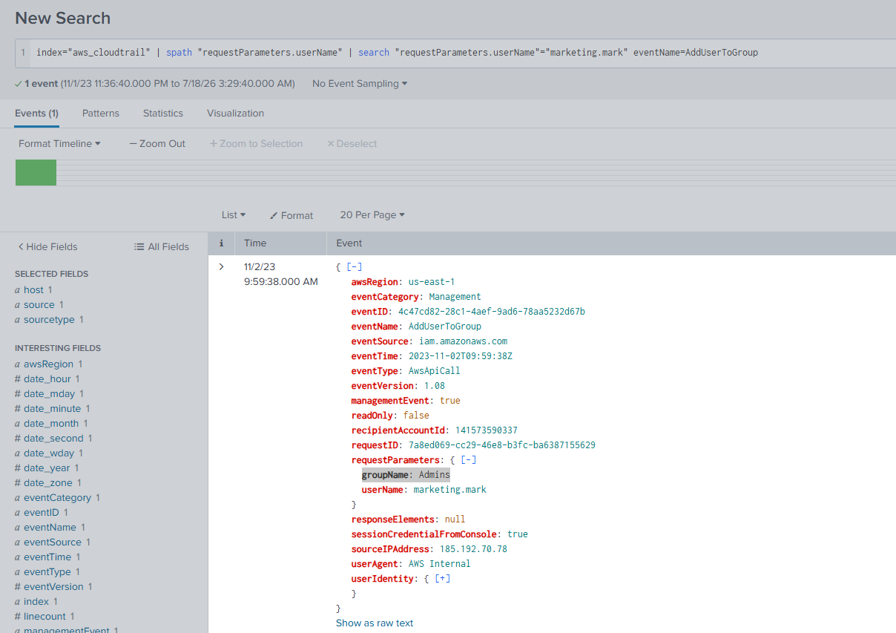

**Answer: Admins**

---

  

## Completed:

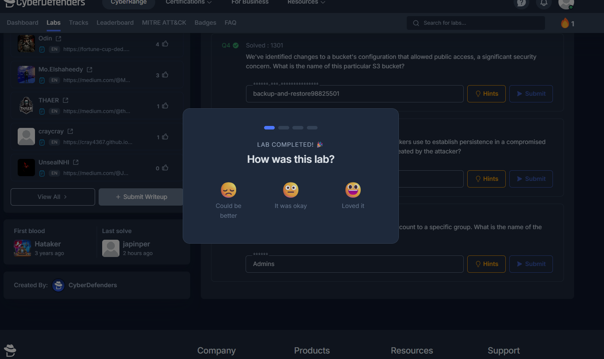
