# Overview: 

### On October 15, 2024, a security breach occurred involving a web application named "Visa Checker," which was hosted on an AWS EC2 instance. The attacker exploited a Server-Side Request Forgery (SSRF) vulnerability within the application, enabling them to steal IAM role credentials. With these compromised credentials, the attacker gained unauthorized access to sensitive information stored in Amazon S3 bucket. This S3 bucket contained data on approximately 20 million tourists.

**The attacker leveraged the stolen credentials to perform various unauthorized actions within the AWS environment, including data exfiltration. To evade detection, the attacker routed their traffic through multiple Tor exit nodes, using anonymized IP addresses to obscure their true location, making it difficult to trace the source of the attack.**

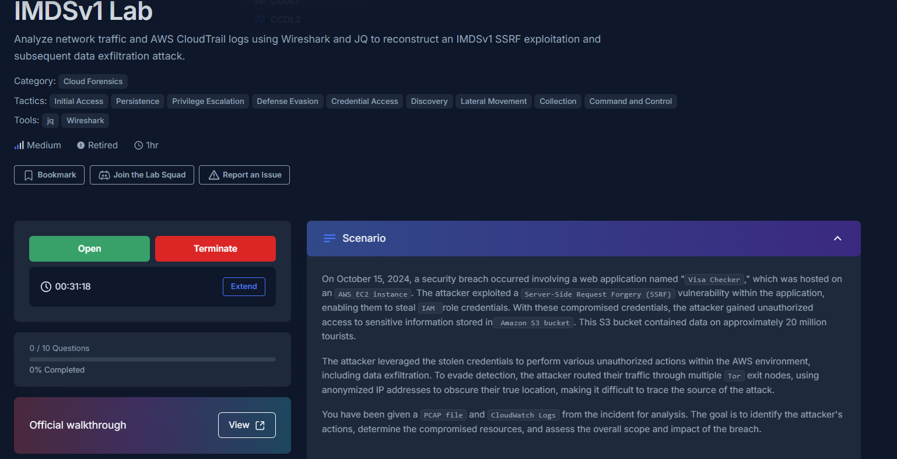

 

### Methodology: 

**We will use a PCAP file and CloudWatch Logs from the incident for analysis. The goal is to identify the attacker's actions, determine the compromised resources, and assess the overall scope and impact of the breach.**

---

 

### Attack Chain: 
                                          SSRF vulnerability tested using an external URL
                                                                ↓
                                        EC2 Instance Metadata Service (IMDS) accessed via SSRF
                                                                ↓
                  IAM role credentials stolen from the EC2 instance (everything from here on out done through Tor exit nodes)
                                                                ↓
                                            Stolen credentials validated with AWS STS
                                                                ↓
                                          AWS resources and S3 buckets enumerated via AWS CLI
                                                                ↓
                                       Sensitive tourist data identified in tourists-visa-info
                                                                ↓
                                        S3 objects downloaded and data exfiltrated (~5.45 GB)
                                                                ↓
                                    Attempt to terminate the EC2 instance (failed - unauthorized)
                                                                ↓
                                       Attempt to create a new IAM user for persistence (failed)
                                                                ↓
                                        S3 objects deleted from tourists-visa-info bucket
                                                                ↓
                                               S3 bucket deleted to destroy evidence
                                                                ↓
                                        Activity routed through Tor exit nodes for anonymity
---

  

## Indicators of Compromise:

| IOC Type   | Indicator                                                                      | Context                                                                            |
| ---------- | ------------------------------------------------------------------------------ | ---------------------------------------------------------------------------------- |
| Source IP  | `147.45.78.34`                                                                 | Tor exit node used for AWS API activity.                                           |
| Source IP  | `109.70.100.67`                                                                | Tor exit node associated with attacker activity.                                   |
| Source IP  | `185.220.100.243`                                                              | Tor exit node used during attempted EC2 termination.                               |
| Source IP  | `193.189.100.204`                                                              | Tor exit node used during destructive S3 deletion activity.                        |
| URI        | `http://169.254.169.254/latest/meta-data/iam/security-credentials/EC2-S3-Visa` | EC2 Instance Metadata Service endpoint targeted to steal IAM credentials via SSRF. |
| User-Agent | `aws-cli/2.18.5`                                                               | AWS CLI version used to perform unauthorized API operations.                       |
| IAM Role   | `EC2-S3-Visa`                                                                  | Compromised EC2 instance role whose temporary credentials were stolen.             |
| S3 Bucket  | `tourists-visa-info`                                                           | Sensitive bucket targeted for enumeration, exfiltration, and deletion.             |

---

 

## MITRE ATT&CK Mapping:

| ATT&CK ID     | Technique                                          | Evidence                                                                                                                   |
| ------------- | -------------------------------------------------- | -------------------------------------------------------------------------------------------------------------------------- |
| **T1190**     | Exploit Public-Facing Application                  | The attacker exploited an SSRF vulnerability in the Visa Checker web application to gain access to internal AWS resources. |
| **T1552.005** | Unsecured Credentials: Cloud Instance Metadata API | The attacker queried the EC2 Instance Metadata Service (`169.254.169.254`) to obtain temporary IAM role credentials.       |
| **T1078.004** | Valid Accounts: Cloud Accounts                     | Stolen IAM role credentials were used to authenticate to AWS and perform unauthorized API operations.                      |
| **T1526**     | Cloud Service Discovery                            | AWS resources, including S3 buckets, were enumerated using the compromised credentials.                                    |
| **T1530**     | Data from Cloud Storage                            | Sensitive data was enumerated and exfiltrated from the `tourists-visa-info` S3 bucket.                                     |
| **T1098**     | Account Manipulation                               | The attacker attempted to create a new IAM user to establish persistence but lacked sufficient permissions.                |
| **T1485**     | Data Destruction                                   | S3 objects and the bucket itself were deleted following data exfiltration.                                                 |

---

 

## Investigation:

### 1. The attacker tested the SSRF vulnerability by accessing an external website. What URL was used to conduct this test?
For this we should analyze http packets in wireshark: 

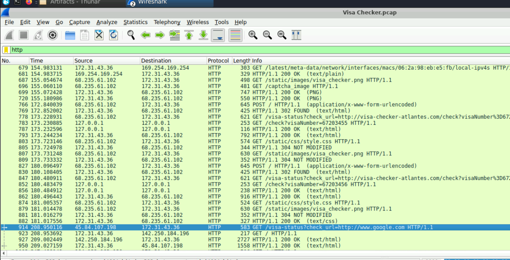

We see lots of get requests from visa-status app to http://visa-checker-atlantes.com, but this is the legit GET request that the app is intended to make. We see a request to google however from IP:45.84.107.198. 

**Answer: http://www.google.com**

---

### 2. The attacker exploited the vulnerable website to send requests, ultimately obtaining the IAM role credentials. What is the exact URI used in the request made by the webserver to acquire these credentials?

There are lots of server-side requests to 169.254.169.254:

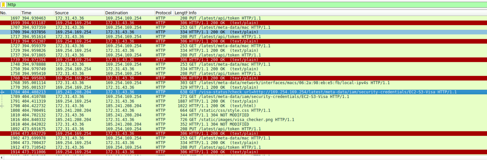

But one in particular where the full URI is indicative of stealing server-side credentials.  

**Answer: http://169.254.169.254/latest/meta-data/iam/security-credentials/EC2-S3-Visa**

---

### 3. The attacker executed an AWS CLI command, similar to whoami in traditional systems, to retrieve information about the IAM user or role associated with the operation. When exactly did he execute that command?

Using "jq '.events[] | .message | fromjson | .eventName' 124355653975_CloudTrail_eu-central-1-logs.json | sort | uniq":

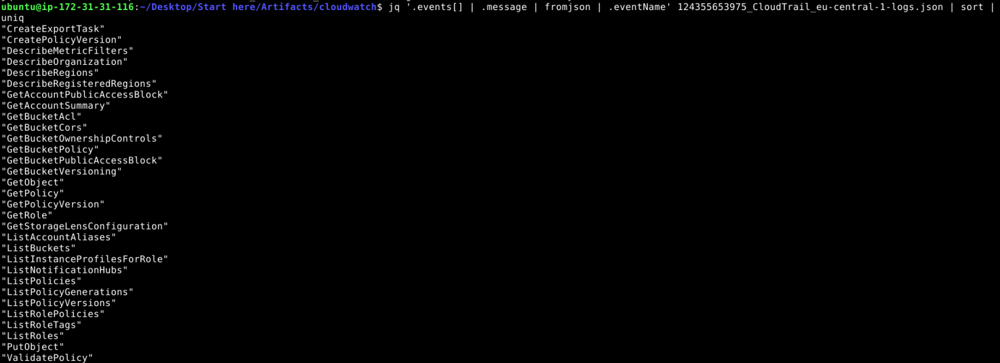

We see that there is nothing that would give us the equivalent of whoami, so then we check in the second file and nothing, and then the third:

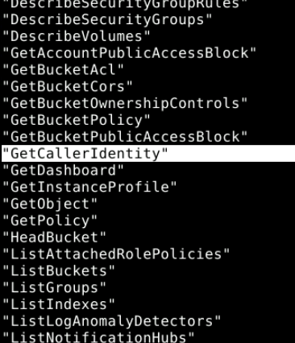

And we see GetCallerIdentity, so we know it's in the 3rd cloudwatch file. Now we need to see when it was:

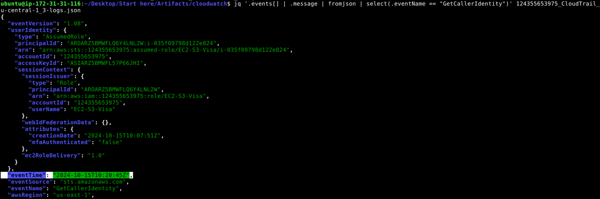

Searching for the full message of the event, we see the timestamp of 2024-10-15T10:20:45Z

**Answer: 2024-10-15 10:20**

---

### 4. During the investigation of the network traffic, we observed that the attacker attempted to retrieve the instance ID and subsequently tried to terminate or shut down the instance. What was the error code returned?

First we will check http GETs to see where the instance ID retrieval attempt was made. Here we can see 2 different possibilities: 

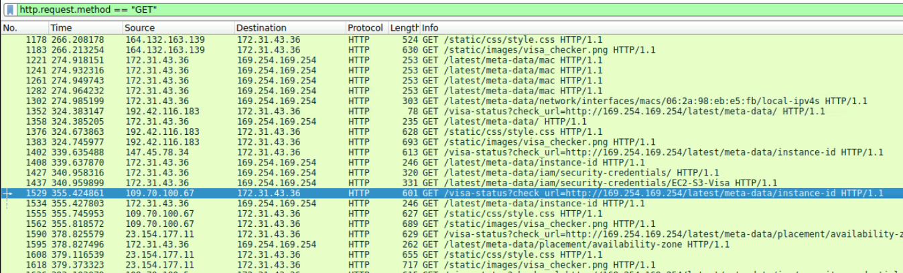

We see here important info like srcIP == 147.45.78.34 for 1402 and srcIP == 109.70.100.67 for 1529. The destIP for both is 172.31.43.36. We can cross reference this info in our cloudwatch querying. After querying logs with those sourceIPs I was confused to not find any attemtps at terminating instances, so I simply checked eventNames in the logs again, and found "TerminateInstance" in log 2: 

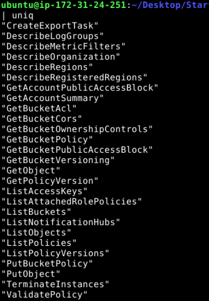

Looking into logs with that name specifically, there is only log: 

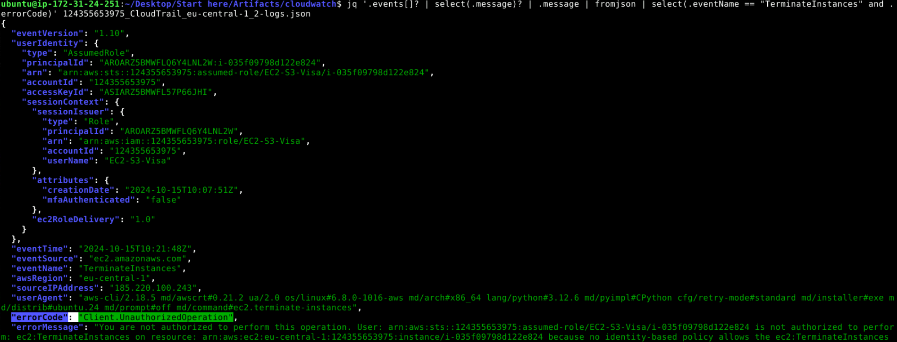

We see the error code as well as a sourceIP of 185.220.100.243, which is why the previous queries weren't working - I guess the attacker used a separate device to try to terminate the instance after getting the ID. Looking back on the lab objective, we see the bit about tor exit nodes - so this makes total sense here.

**Answer: Client.UnauthorizedOperation**

---

### 5. The attacker made an attempt to create a new user but lacked the necessary permissions. What was the username the attacker tried to create?

Checking the logs for eventNames again:

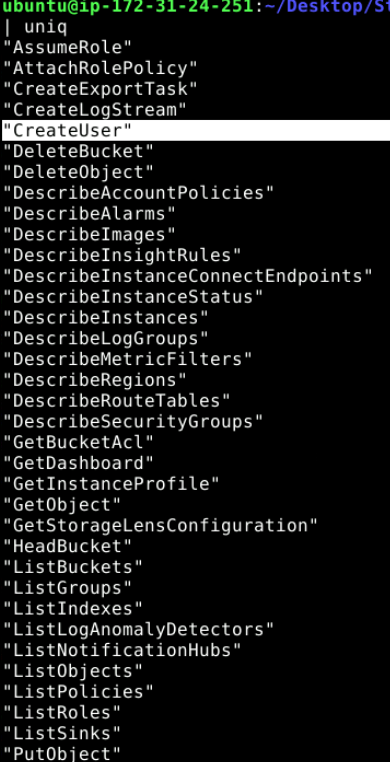

We see CreateUser in log 4. Analyzing logs with that eventName:

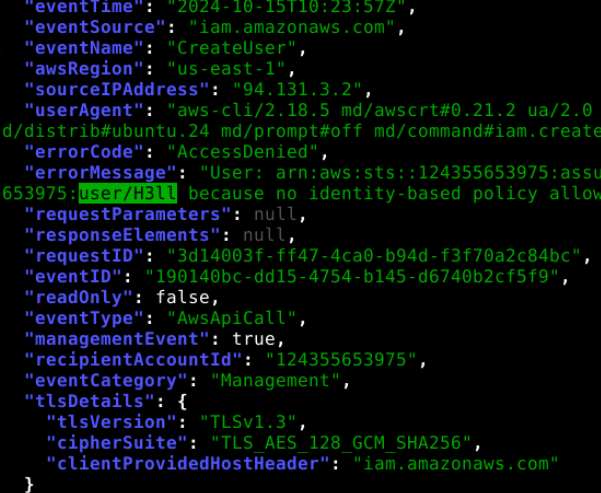

We see the attempted creation of the user was under the name "H3LL"

**Answer:**

---

### 6. Which version of the AWS CLI did the attacker use?

We see in the answer to number 4 that the version is 2.18.5
**Answer: aws-cli/2.18.5**

---

### 7. After listing the available S3 buckets, the attacker proceeded to list the contents of one of them, Which bucket did the attacker list its contents?

Listing out the eventNames again, we see "ListObjects" in logs 2 3 and 4, so we will analyze these, so we will analyze these as we know objects are the data inside buckets. Mostly, the only buckets with objects listed are "aws-cloudtrail-logs" buckets, which we know just holds logs - not actual sensitive info. However some ListObjects logs are from a different bucket: 

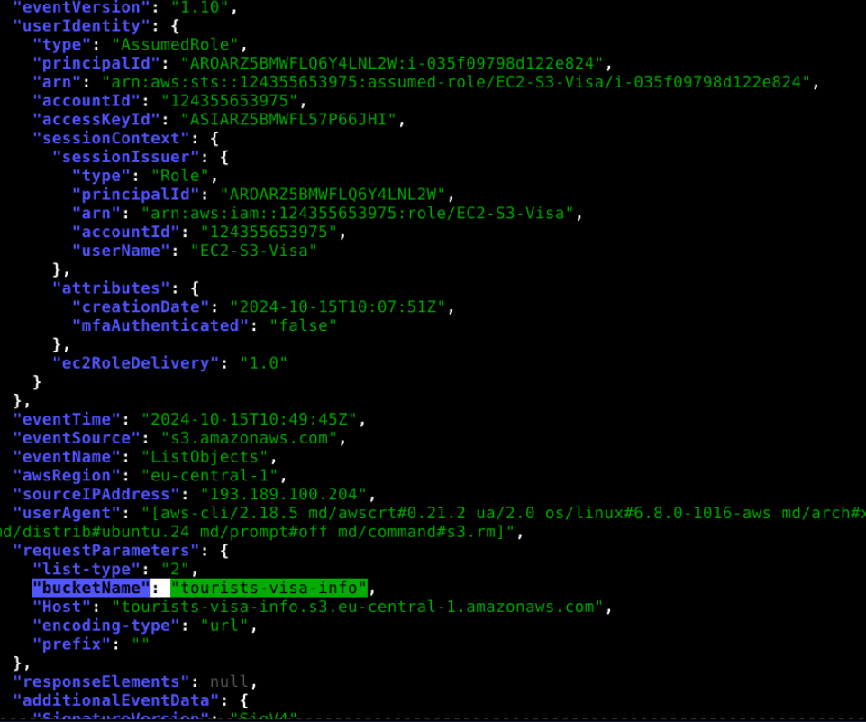

We see here the bucket tourists-visa-info has objects being listed.
**Answer: tourists-visa-info**

---

### 8. The attacker subsequently began downloading data from the bucket. What was the total amount of data stolen, measured in bytes?

We can calculate the total amount of bytesOut from getting each GetObject API call from the tourists-visa-info bucket and adding them all up with:

jq '[.events[]? | select(.message)? | .message | fromjson | select(.requestParameters.bucketName == "tourists-visa-info" and .eventName == "GetObject") | .additionalEventData.bytesTransferredOut // 0] | add' 124355653975_CloudTrail_eu-central-1-logs.json

This gives us the total bytes out for one log file. Doing this for all 4 log files we get:

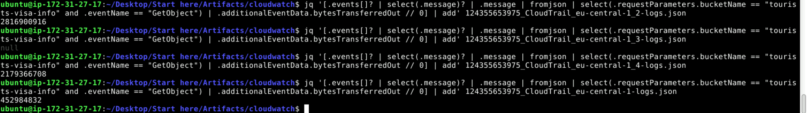

Adding 2816900916 + 2179366708 + 452984832 we get 5449252456 total bytes.

**Answer: 5449252456**

---

### 9. After stealing the data, the attacker began deleting the contents of the bucket. What IP address was used during these deletion activities?

Searching for eventName == "DeleteObject", we see this in log file 4:

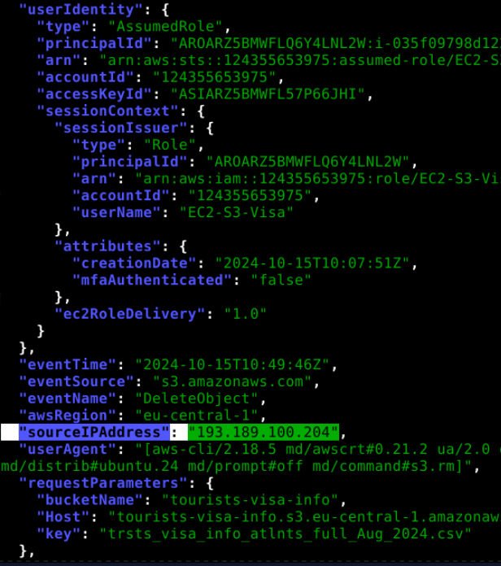

Here we can see the IP address associated with the object deletion is "193.189.100.204".

**Answer: 193.189.100.204**

---

### 10. The attacker executed a deletion operation on the bucket, removing all of its contents. Every request in AWS is linked to a unique identifier for tracking purposes. What was the request ID associated with the bucket's deletion event?

Searching for eventName == "DeleteBucket," we see this also in log file 4:

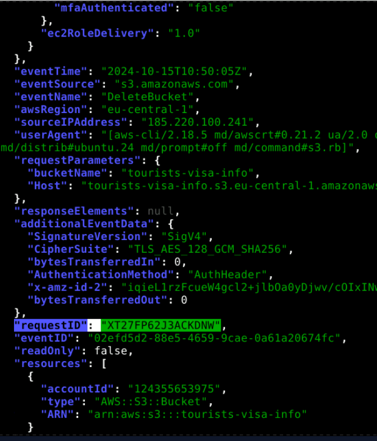

The request ID of the API call is "XT27FP62J3ACKDNW"

**Answer: XT27FP62J3ACKDNW**

---

 

**Complete:**

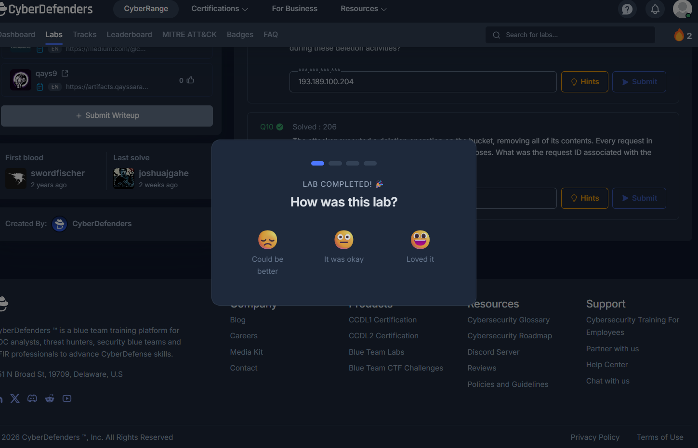
