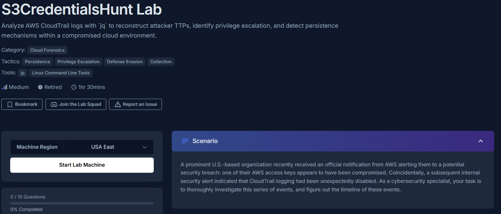
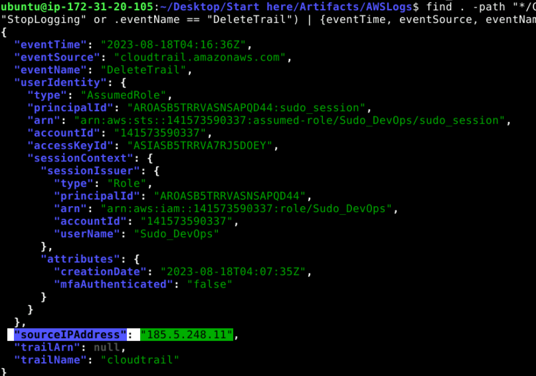
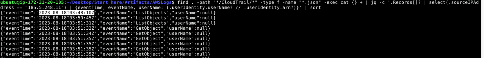
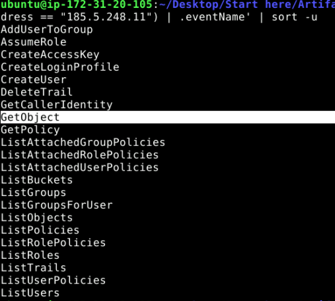
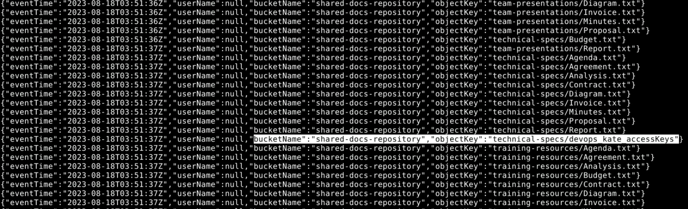
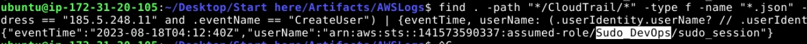
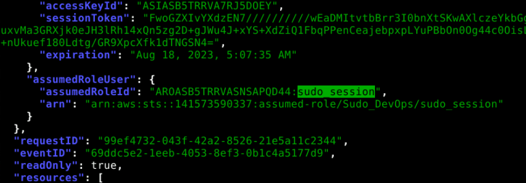
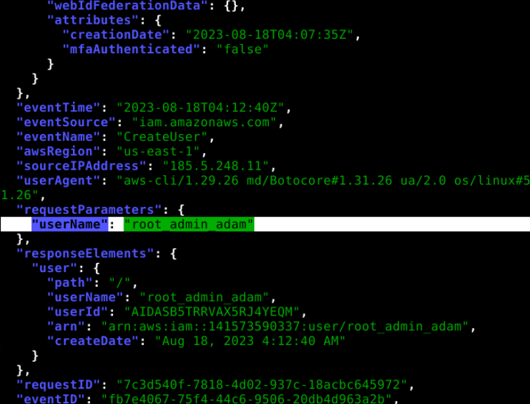
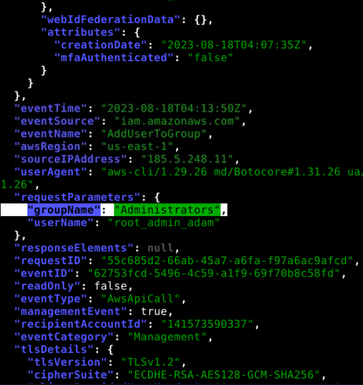
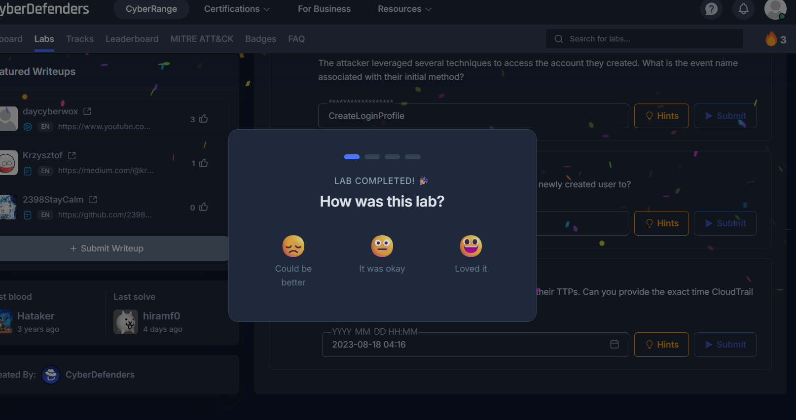

# Overview: 

### A prominent U.S.-based organization recently received an official notification from AWS alerting them to a potential security breach: one of their AWS access keys appears to have been compromised. Coincidentally, a subsequent internal security alert indicated that CloudTrail logging had been unexpectedly disabled.

 

### Methodology: 

**We are tasked with using jq to thoroughly investigate this series of events, and figure out the timeline of these events.**

---

 

### Attack Chain: 

                                                          Initial Access
                                                                ↓
                                                Exposed AWS credentials discovered
                                                                ↓
            Compromised devops_kate credentials retrieved from S3: shared-docs-repository/technical-specs/devops_kate_accessKeys
                                                                ↓
                                          Attacker authenticates using stolen AWS credentials
                                                                ↓
                                                  S3 Discovery and Data Access
                                                                ↓
                       Privilege Escalation via IAM Role Assumption with Role: Sudo_DevOps and Session: sudo_session
                                                                ↓
                                      Persistence Established, Created IAM User root_admin_adam
                                                                ↓
                                        Privilege Expansion, Added User to Administrators Group
                                                                ↓
                                                Defense Evasion, CloudTrail Deleted

---

  

## Indicators of Compromise:

| IOC Type                  | Value               |
| -------------------------- | -------------------- |

---

 

## MITRE ATT&CK Mapping:

| ATT&CK ID | Technique                                                | Evidence                                        |
| --------- | -------------------------------------------------------- | ----------------------------------------------- |

---

 

## Investigation:

### 1. To properly track the activities done by the attacker in the environment, you will need to determine the source of the attack. What is the attacker's IP address?

Looking through the files, we have a large number of compressed cloudtrail logs in various subdirectories which at first seems intimidating, and we need to first decompress them to view:

find . -type f -name "*.gz" -exec gunzip {} \;

This takes all of the directory and subdirectory's compressed files and decompresses them in one go. Now we need to find the moment where cloudtrail logs were disabled by the attacker: 

find . -path "*/CloudTrail/*" -type f -name "*.json" -exec cat {} + | jq '.Records[]? | select(.eventName == "StopLogging" or .eventName == "DeleteTrail") | {eventTime, eventSource, eventName, userIdentity, sourceIPAddress, trailArn, trailName: .requestParameters?.name}'

Luckily jq lets us run through all the log files in single commands - this particular query goes through all of the now unzipped logs in the subdirectories and extracts events where eventName is StopLogging or DeleteTrail and outputs important info regarding the event:

As we can see here the eventName is DeleteTrail and the sourceIP of the attacker responsible is 185.5.248.11.

**Answer: 185.5.248.11**

---

### 2. A timeline for the incident will help identify the gaps in your investigation. When did the attacker interact with the server for the first time?

Now I'll just sort all of the events with the attacker's sourceIP by time ascending: 

find . -path "*/CloudTrail/*" -type f -name "*.json" -exec cat {} + | jq -c '.Records[]? | select(.sourceIPAddress == "185.5.248.11") | {eventTime, eventName, userName: (.userIdentity.userName? // .userIdentity.arn?)}' | sort

We see the first interaction was a ListObjects call at 2023-08-18T03:48:10Z.

**Answer: 2023-08-18 03:48**

---

### 3. To ensure the environment is safe after the recent breach, identifying the attacker's entry point is essential. What is the exact file path from which the attacker retrieved the compromised user access key?

For this I'm first going to list all of the unique eventNames associated with the attacker's sourceIP to see what eventName clues us into how he stole the access key:

Out of these, it has to be GetObject that was responsible, so let's look further into that using: 

find . -path "*/CloudTrail/*" -type f -name "*.json" -exec cat {} + | jq -c '.Records[]? | select(.sourceIPAddress == "185.5.248.11" and .eventName == "GetObject") | {eventTime, userName: (.userIdentity.userName? // .userIdentity.arn?), bucketName: .requestParameters?.bucketName, objectKey: .requestParameters?.key}' | sort

There are lots of GetObject calls but one that catches my eye:

The object key of "technical-specs/devops_kate_accessKeys" with the bucket name "shared-docs-repository" is gonna be our winner. Putting it together, the full file path would be "shared-docs-repository/technical-specs/devops_kate_accessKeys"

**Answer: shared-docs-repository/technical-specs/devops_kate_accessKeys**

---

### 4. In a cloud environment, determining the user context can help assess the potential extent of damage based on the permissions and resources accessible to that user. What is the 'Type' of the user who disabled CloudTrail?

We can see in #1 that the attacker is under an "AssumedRole".

**Answer: AssumedRole**

---

### 5. From the previous question, you determined the attacker's access type; now, you need to figure out what resources the attacker has access to. What is the name of the role the attacker takes advantage of to escalate his privilege in the environment?

In #3 we see CreateUser is one of the eventNames associated with the attacker IP, and we know creating a user would need to be done with escalated privileges, so we analyze this log to see what the name of the role is: 

Here we see that the role taken advantage of is "Sudo_DevOps". We also see this in #1 but just wanted to double check here.

**Answer: Sudo_DevOps**

---

### 6. In AWS, to enhance security, users are granted temporary access to specific resources when they assume a role. This action results in the creation of a session, characterized by a unique name and credentials. To trace the attacker's TTPs, can you identify the name of the session they initiated?

Again referencing #3 of the unique eventNames from attacker IP, we see "AssumeRole," which we know will have info about the associated sesison name:

Analyzing those logs we see that the sesison name is "sudo_session".

**Answer: sudo_session**

---

### 7. To effectively mitigate risks, it's crucial to determine whether the attacker attempted to establish persistence for ongoing access. Can you identify the name of the user the attacker created to maintain a foothold on the machine?

Analyzing the "CreateUser" call logs deeper, we see that:

The user created is "root_admin_adam".

**Answer: root_admin_adam**

---

### 8. The attacker leveraged several techniques to access the account they created. What is the event name associated with their initial method?
Again referencing #3 of the unique eventNames from attacker IP, we see 2 potential events that could fit here: "CreateLoginProfile," and "CreateAccessKey," and between those we know that CreateLoginProfile would need to come first, and then creating an access key would follow, so it must be "CreateLoginProfile".

**Answer: CreateLoginProfile**

---

### 9. What is the name of the group the attacker added the newly created user to?
Referencing #3 yet again, we see the eventName "AddUserToGroup," so we will analyze this file deeper: 

And we see the group that root_admin_adam was added to is "Administrators".

**Answer: Administrators**

---

### 10. Sophisticated threat actors often attempt to conceal their TTPs. Can you provide the exact time CloudTrail logging was disabled?
We see in the photo in #1 the exact timestamp of the "DeleteTrail" event: 2023-08-18T04:16:36Z

**Answer: 2023-08-18 04:16**

---

 

**Complete:**

